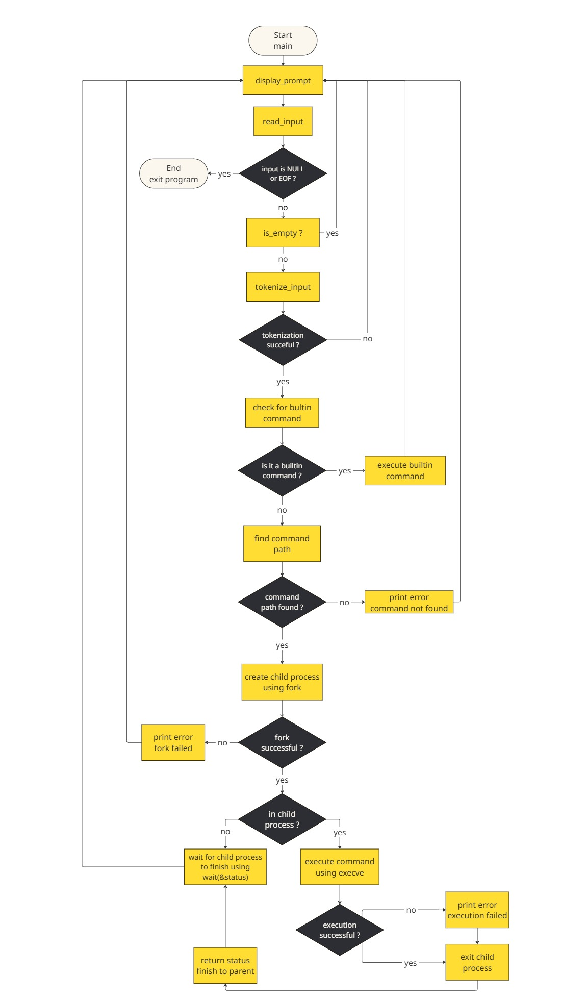

# Simple shell Project

## Introduction
Inspired by the behavior of Unix shells like bash or sh, this project aims to understand and replicate the fundamental behavior of a shell: reading user commands, interpreting them, and executing the corresponding programs.

## Usage

```c
#include "shell.h"

void display_usage(void)
{
	printf("Usage: ./my_shell\n");
	printf("A minimal Unix-like shell that reads and executes commands.\n\n");

	printf("Built-in commands:\n");
	printf("  exit : Exit the shell\n");
	printf("  env  : Print the environment variables\n\n");

	printf("Supported external commands (via PATH):\n");
	printf("  ls   : List directory contents (e.g., /bin/ls)\n");
	printf("  All other commands found in your PATH are also supported\n");
}
```
## How to execute man page

```c
man ./man_simple_shell
```

## List of allowed functions and system calls+

- all functions from string.h
- `access` (man 2 access)
- `chdir` (man 2 chdir)
- `close` (man 2 close)
- `closedir` (man 3 closedir)
- `execve` (man 2 execve)
- `exit` (man 3 exit)
- `_exit` (man 2 _exit)
- `fflush` (man 3 fflush)
- `fork` (man 2 fork)
- `free` (man 3 free)
- `getcwd` (man 3 getcwd)
- `getline` (man 3 getline)
- `getpid` (man 2 getpid)
- `isatty` (man 3 isatty)
- `kill` (man 2 kill)
- `malloc` (man 3 malloc)
- `open` (man 2 open)
- `opendir` (man 3 opendir)
- `perror` (man 3 perror)
- `printf` (man 3 printf)
- `fprintf` (man 3 fprintf)
- `vfprintf` (man 3 vfprintf)
- `sprintf` (man 3 sprintf)
- `putchar` (man 3 putchar)
- `read` (man 2 read)
- `readdir` (man 3 readdir)
- `signal` (man 2 signal)
- `stat` (__xstat) (man 2 stat)
- `lstat` (__lxstat) (man 2 lstat)
- `fstat` (__fxstat) (man 2 fstat)
- `strtok` (man 3 strtok)
- `wait` (man 2 wait)
- `waitpid` (man 2 waitpid)
- `wait3` (man 2 wait3)
- `wait4` (man 2 wait4)
- `write` (man 2 write)

## Features

- Custom shell prompt waiting for user commands
- Support for built-in commands:
  - `exit` : exits the shell
  - `env` : displays environment variables
- Execution of external commands using the `PATH`
- Error handling with custom error messages
- Line-by-line input handling (both interactive and non-interactive mode)
- Graceful exit on `Ctrl+D` (EOF)

## Technical requirements and constraints
- Allowed editors: `vi`, `vim`, `emacs`
- All the files will be compiled on Ubuntu 20.04 LTS using gcc, using the options `-Wall -Werror -Wextra -pedantic -std=gnu89`
- All the files should end with a new line
- A `README.md` file, at the root of the folder of the project is mandatory
- The code should use the `Betty` style. It will be checked using `betty-style.pl` and `betty-doc.pl`
- The shell should not have any memory leaks
- No more than 5 functions per file
- All the header files should be include guarded
- Use system calls only when it need to


## Example

```bash
Works like this in interactive mode:

#cisfun$ ./simple_shell
#cisfun$ ls
file1.c  main.c  shell.h
#cisfun$ env
USER=yourname
PATH=/usr/bin:/bin
#cisfun$ exit

But also in non-interactive mode:

julien@ubuntu:/# echo "/bin/ls" | ./hsh
hsh main.c shell.c test_ls_2
julien@ubuntu:/# cat test_ls_2
/bin/ls
/bin/ls
julien@ubuntu:/# cat test_ls_2 | ./hsh
hsh main.c shell.c test_ls_2
hsh main.c shell.c test_ls_2
julien@ubuntu:/#
```

## Flowchart :



## Man Page :

```man
SIMPLE_SHELL(1)                       Holberton Simple Shell                      SIMPLE_SHELL(1)

NAME
       simple_shell - simple UNIX command interpreter

SYNOPSIS
       ./hsh

DESCRIPTION
       A  minimal shell written in C. It reads user input, parses it, and executes commands using
       the PATH.  It supports both interactive and non-interactive modes.

BUILTINS
       exit   Exit the shell. If called with an optional numeric argument, it returns that  value
              as the exit status.

       env    Display the current environment variables.

USAGE
       The shell supports:

       - Interactive mode: Displays a prompt and waits for user input.

       - Non-interactive mode: Reads commands from a file or standard input.

EXAMPLES
       Interactive mode:
       $ ./simple_shell
       #cisfun$ ls -l
       total 8
       -rw-r--r-- 1 user user 1234 Apr 24 2025 file1
       -rw-r--r-- 1 user user 5678 Apr 24 2025 file2
       #cisfun$ exit
       $

       Non-interactive mode:
       $ echo "ls -l" | ./simple_shell
       total 8
       -rw-r--r-- 1 user user 1234 Apr 24 2025 file1
       -rw-r--r-- 1 user user 5678 Apr 24 2025 file2
       $

RETURN VALUE
       simple_shell returns 0 on success, or an error code if a failure occurs.

BUGS
       No known bugs at this time.

AUTHOR
       Ninaglss and Mylliah

1.0                                       21 avril 2025                           SIMPLE_SHELL(1)
```

## Explanation of files

### main.c
Entry point of the shell. Contains the main loop that handles user input.

### path.c
This file contains functions responsible for locating the full path of a command using the PATH environment variable.

### aux.c
This file contains helper functions used throughout the shell project to keep the code clean and modular.

### display_prompt.c
This file contains the function responsible for displaying the shell prompt to the user.

### execute_command.c
This file contains the core logic to process and execute commands entered by the user.

### execute_in_child.c
This file handles the execution of external commands in a child process.

### handle_builtin.c
This file manages built-in commands supported by the shell, such as exit and env.

### read_input.c
This file handles user input reading from the terminal.

### tokenize.c
This file is responsible for splitting user input into separate tokens (command and arguments).

## Explanation of code

### Displays the shell prompt to the user
`void display_prompt(void);`


### Reads the user's input from stdin and returns the typed line
`char *read_input(void);`

### Executes the given command
- `cmd`: command string to execute
- `prog_name`: program name, used for error messages
- `void execute_command(char *cmd, char *prog_name);`

### Checks if a string is empty or contains only whitespace
- `str`: string to check
- `Return`: 1 if empty or only spaces, 0 otherwise
- `int is_empty(const char *str);`

### Splits a command line into tokens (words)
- `line`: input line to tokenize
- `Return`: array of strings (tokens), ending with NULL
- `char **tokenize_input(char *line);`

### Frees the memory allocated for the token array
- `tokens`: array to free
- `void free_tokens(char **tokens);`

### Executes a command in a child process using execve
- `args`: array of arguments (command + options)
- `prog_name`: program name for error display
- `void execute_in_child(char **args, char *prog_name);`

### Finds the full path of a command by checking directories in PATH
- `cmd`: command name to search for
- `Return`: full path if found, NULL otherwise
- `char *find_command_path(const char *cmd);`

### Handles built-in commands like "exit"
- `args`: argument array
- `line`: command line (to free if needed)
- `Return`: 1 if a built-in was executed, 0 otherwise
- `int handle_builtin(char **args, char *line);`

## Compilation
To compile simple shell use:
```sh
gcc -Wall -Werror -Wextra -pedantic -std=gnu89 *.c -o hsh
```
## Code Quality & Memory Management :

### Memory Leak Testing with Valgrind

To ensure that your shell does not have memory leaks, use **Valgrind** for memory diagnostics. It's essential for checking proper allocation and deallocation of memory.

**How to test:**

```bash
valgrind ./hsh
```
### Code Quality with Betty

Betty is a style linter for C code used at Holberton to enforce code readability and consistency.

**How to test:**

```bash
betty + <name_of_file>
```

## Authors
- [Ninaglss15](https://github.com/ninaglss15)
- [Mylliah](https://github.com/Mylliah)
